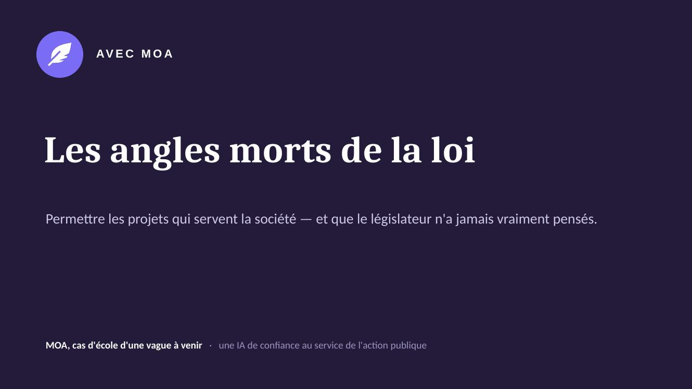

# DEFI.md

### Nom du défi
Post-partum : détecter les angles morts de la loi et de son application grâce à une IA de confiance

### Description courte
Une IA de confiance qui lit les données publiques (loi, débats, rapports, questions parlementaires) et en produit une fiche claire et sourcée sur une politique publique : ce que dit la loi, ce qui manque, ce qui n'est pas appliqué, et les pistes d'action. Le post-partum sert d'exemple ; la méthode est générique.

### Porteur
Avec MOA — Frédéric Lallier

### Description longue
**Le problème.** La méconnaissance de la loi nourrit la méfiance : citoyens comme décideurs peinent à savoir ce que le droit prévoit réellement sur un sujet, ce qu'il ne couvre pas, et ce qui n'est pas appliqué sur le terrain. Ces « angles morts » sont autant d'écarts entre l'intention de la loi, les dispositifs publics et la réalité vécue.

**Le défi.** Exploiter les données ouvertes mises à disposition pour le hackathon — serveur MCP et API unifiés Parlement / Législation / Service Public, dossiers législatifs, comptes rendus des débats, questions écrites et orales au Gouvernement, textes consolidés Légifrance — pour générer, sur une politique publique donnée, une **fiche de synthèse claire et sourcée** structurée en quatre blocs :

1. **État du droit** — ce que la loi et les dispositifs prévoient aujourd'hui.
2. **Débats, rapports et questions** — ce qui ressort des travaux parlementaires.
3. **Lacunes d'application** — là où le droit et le terrain cessent de se rejoindre.
4. **Pistes d'action** — leviers concrets : question écrite, amendement, demande de rapport, mission d'information.

**IA de confiance.** Chaque ligne renvoie à sa source officielle : traçable, vérifiable, jamais inventée. L'outil éclaire, il ne tranche pas — la décision reste humaine. La fiche sert autant le travail parlementaire (une « fiche député » prête à l'emploi) qu'un objectif citoyen : **permettre à tout un chacun de mieux comprendre ce que la loi permet et ce qu'elle limite.**

**Cas d'usage démonstratif.** Le post-partum — sujet humain fort, transversal, où l'écart entre norme, dispositifs et réalité est manifeste. Mais la méthode est **générique** et s'inscrit dans les thématiques « Accessibilité de la loi », « Application des lois », « Évaluation » et « Rapports et travaux ».

**Déroulé envisagé sur les deux jours.**
- Brancher le prototype sur le serveur MCP / l'API unifiés et Légifrance.
- Construire les requêtes des quatre blocs sur le cas post-partum.
- Générer une première fiche sourcée de bout en bout.
- Généraliser la méthode à une deuxième politique publique pour démontrer sa portée.

### Image principale

### Contributeurs
- Frédéric Lallier

### Ressources utilisées
- [x] `an-dossiers-legislatifs` — Dossiers législatifs de l'Assemblée nationale (législature courante) ✺ Assemblée nationale
- [x] `an-amendements-xvii` — Amendements déposés à l'Assemblée nationale (législature actuelle) ✺ Assemblée nationale
- [x] `an-comptes-rendus` — Comptes rendus de la séance publique à l'Assemblée nationale (législature actuelle) ✺ Assemblée nationale
- [x] `an-questions-gouvernement` — Questions de l'Assemblée nationale au Gouvernement ✺ Assemblée nationale
- [x] `an-questions-gouvernement-ecrites` — Questions écrites de l'Assemblée nationale au Gouvernement ✺ Assemblée nationale
- [x] `an-questions-gouvernement-orales` — Questions orales de l'Assemblée nationale au Gouvernement ✺ Assemblée nationale
- [x] `premier-ministre-legi` — Codes, lois et règlements consolidés ✺ Premier ministre
- [x] `premier-ministre-dole` — Dossiers législatifs Légifrance ✺ Premier ministre
- [x] `premier-ministre-jorf` — Édition ''Lois et décrets'' du Journal officiel ✺ Premier ministre
- [x] `an-et-co-database-regroupement-toutes-donnees` — Base de données unifiée Parlement / Législation / Service Public ✺ Assemblée nationale & communauté
- [x] `an-et-co-serveur-mcp-regroupement-toutes-donnees` — Serveur MCP - Accès unifié Parlement / Législation / Service Public ✺ Assemblée nationale & communauté
- [x] `an-et-co-api-regroupement-toutes-donnees` — API - Accès unifié Parlement / Législation / Service Public ✺ Assemblée nationale & communauté

### URL de démonstration
https://avec-moa.com/demonstrateur.html

### Diapositives de présentation
[Diapositives de présentation](docs/diapositives.pdf)
